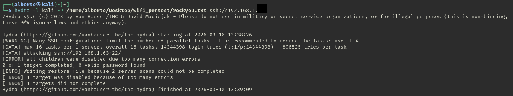

# Password Brute Force Attack with Hydra

## Objective

The objective of this lab is to demonstrate how brute force attacks can be performed against an SSH service using Hydra.

## Tool

Hydra is a fast network login cracker that supports many protocols including:

- SSH
- FTP
- HTTP
- SMB
- Telnet

It is commonly used in penetration testing to test password strength and authentication security.

## Target

Local SSH service in a controlled lab environment.

For security reasons the real IP address is masked.

Example target:

ssh://192.168.X.X

## Command Used

hydra -l kali -P rockyou.txt ssh://192.168.X.X

### Explanation

- `-l` : username
- `-P` : password dictionary
- `ssh://` : target service

Hydra attempts multiple passwords from a dictionary against a login service.

This technique is known as a **dictionary attack**.

## Result

During the brute force attempt Hydra started attacking the SSH service.

Example output:

[DATA] attacking ssh://TARGET_IP:22
[ERROR] all children were disabled due too many connection errors
target was disabled because of too many errors

This happened because the SSH service limited the number of connection attempts.

## Screenshot

## Analysis

The SSH service prevented the brute force attack by limiting connection attempts.

This demonstrates the importance of security mechanisms such as:

- rate limiting
- connection throttling
- brute force protection

These protections help mitigate password guessing attacks.

## Conclusion

Brute force attacks highlight the importance of:

- strong passwords
- account lockout policies
- multi-factor authentication
