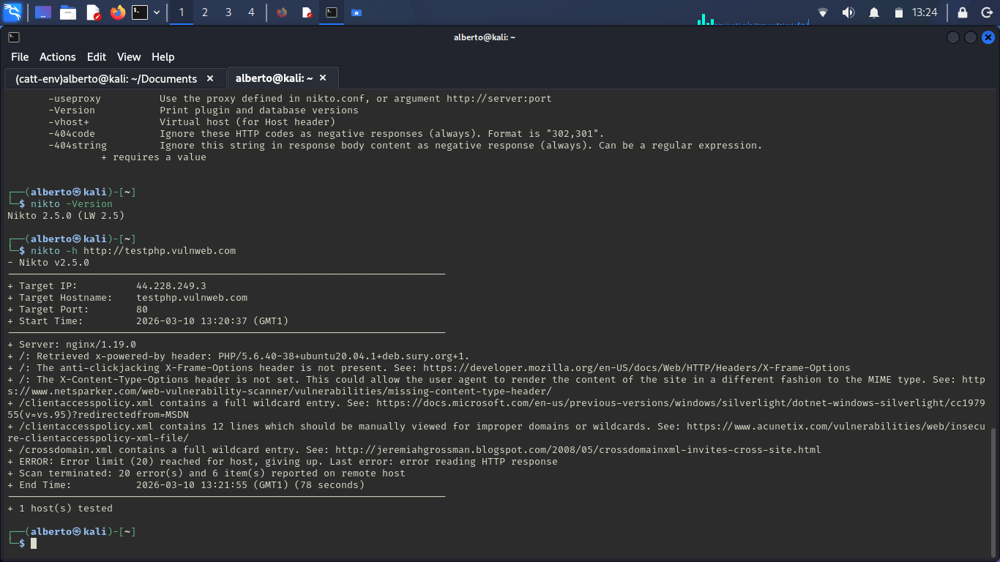

# Web Vulnerability Scan with Nikto

## Objective

The objective of this lab is to identify potential web server vulnerabilities using the Nikto scanner.

## Target

http://testphp.vulnweb.com

This website is intentionally vulnerable and designed for security testing.

## Command Used

nikto -h http://testphp.vulnweb.com

## Tool Explanation

Nikto is an open-source web server scanner that detects:

- outdated software
- insecure configurations
- dangerous files
- known vulnerabilities

## Scan Result

## Findings

The scan detected several security issues:

- Missing **X-Frame-Options** header
- Missing **X-Content-Type-Options** header
- Potential insecure configuration files

These issues could allow attackers to perform attacks such as clickjacking or content-type manipulation.

## Conclusion

Nikto is useful for quickly identifying common web server misconfigurations and potential vulnerabilities.